# PROJECT

> Generated by [`prisma-markdown`](https://github.com/samchon/prisma-markdown)

- [default](#default)

## default

```mermaid
erDiagram
"usuarios" {
  String(36) id PK
  String email UK
  String nombre
  String apellido
  String password_hash
  rol_usuario rol
  String(36) almacen_id FK "nullable"
  Boolean activo
  DateTime(6) creado_en
  DateTime(6) actualizado_en
  DateTime(6) eliminado_en "nullable"
  String creado_por
  String actualizado_por
}
"almacenes" {
  String(36) id PK
  String nombre
  String codigo UK
  tipo_almacen tipo
  String direccion "nullable"
  String telefono "nullable"
  String email "nullable"
  Boolean activo
  DateTime(6) creado_en
  DateTime(6) actualizado_en
  DateTime(6) eliminado_en "nullable"
  String creado_por
  String actualizado_por
}
"habilitaciones_almacen" {
  String(36) id PK
  String(36) almacen_id FK
  tipo_habilitacion tipo
  String numero_habilitacion
  String organismo_emisor
  DateTime(6) fecha_emision
  DateTime(6) fecha_vencimiento
  String archivo_url "nullable"
  String notas "nullable"
  DateTime(6) creado_en
  DateTime(6) actualizado_en
  DateTime(6) eliminado_en "nullable"
  String creado_por
  String actualizado_por
}
"proveedores" {
  String(36) id PK
  String razon_social
  String cuit UK
  String telefono "nullable"
  String email "nullable"
  String direccion "nullable"
  Boolean activo
  DateTime(6) creado_en
  DateTime(6) actualizado_en
  DateTime(6) eliminado_en "nullable"
  String creado_por
  String actualizado_por
}
"familias_productos" {
  String(36) id PK
  String nombre_generico
  String accion_terapeutica "nullable"
  String via_administracion "nullable"
  String(36) proveedor_id FK
  Boolean activo
  DateTime(6) creado_en
  DateTime(6) actualizado_en
  DateTime(6) eliminado_en "nullable"
  String creado_por
  String actualizado_por
}
"productos" {
  String(36) id PK
  String nombre
  String descripcion "nullable"
  String codigo_barras "nullable"
  String troquel "nullable"
  String gtin "nullable"
  String clave_cnpm "nullable"
  tipo_venta_producto tipo_venta
  String(36) proveedor_id FK
  String(36) familia_id FK "nullable"
  Boolean activo
  DateTime(6) creado_en
  DateTime(6) actualizado_en
  DateTime(6) eliminado_en "nullable"
  String creado_por
  String actualizado_por
}
"precios_productos" {
  String(36) id PK
  String(36) producto_id FK
  Int alicuota_iva_bps
  BigInt precio_neto
  BigInt precio_final
  DateTime(6) vigente_desde
  DateTime(6) vigente_hasta "nullable"
  String fuente "nullable"
  DateTime(6) creado_en
  DateTime(6) actualizado_en
  DateTime(6) eliminado_en "nullable"
  String creado_por
  String actualizado_por
}
"stocks_almacen" {
  String(36) id PK
  String(36) almacen_id FK
  String(36) producto_id FK
  Int cantidad
  Int stock_minimo
  DateTime(6) creado_en
  DateTime(6) actualizado_en
  DateTime(6) eliminado_en "nullable"
  String creado_por
  String actualizado_por
}
"lotes_stock" {
  String(36) id PK
  String(36) producto_id FK
  String numero_lote
  DateTime(6) fecha_vencimiento "nullable"
  Int cantidad
  DateTime(6) creado_en
  DateTime(6) actualizado_en
  DateTime(6) eliminado_en "nullable"
  String creado_por
  String actualizado_por
}
"movimientos_stock" {
  String(36) id PK
  String(36) almacen_id
  String(36) producto_id
  tipo_movimiento_stock tipo_movimiento
  Int cantidad
  String(36) referencia_id "nullable"
  String referencia_tipo "nullable"
  String notas "nullable"
  DateTime(6) creado_en
  String creado_por
}
"ordenes_compra" {
  String(36) id PK
  String numero_orden UK
  String(36) almacen_id FK
  String(36) proveedor_id FK
  estado_orden_compra estado
  String notas "nullable"
  DateTime(6) fecha_esperada "nullable"
  DateTime(6) recibido_en "nullable"
  DateTime(6) creado_en
  DateTime(6) actualizado_en
  DateTime(6) eliminado_en "nullable"
  String creado_por
  String actualizado_por
}
"items_ordenes_compra" {
  String(36) id PK
  String(36) orden_id FK
  String(36) producto_id FK
  Int cantidad_pedida
  Int cantidad_recibida
  BigInt precio_unitario
  DateTime(6) creado_en
  DateTime(6) actualizado_en
  DateTime(6) eliminado_en "nullable"
  String creado_por
  String actualizado_por
}
"transferencias_almacen" {
  String(36) id PK
  String numero_transferencia UK
  String(36) almacen_origen_id FK
  String(36) almacen_destino_id FK
  estado_transferencia estado
  String notas "nullable"
  DateTime(6) enviado_en "nullable"
  DateTime(6) recibido_en "nullable"
  DateTime(6) creado_en
  DateTime(6) actualizado_en
  DateTime(6) eliminado_en "nullable"
  String creado_por
  String actualizado_por
}
"ventas" {
  String(36) id PK
  String numero_venta UK
  String(36) almacen_id FK
  estado_venta estado
  String notas "nullable"
  DateTime(6) vendido_en
  DateTime(6) creado_en
  DateTime(6) actualizado_en
  DateTime(6) eliminado_en "nullable"
  String creado_por
  String actualizado_por
}
"items_ventas" {
  String(36) id PK
  String(36) venta_id FK
  String(36) producto_id FK
  Int cantidad
  Int alicuota_iva_bps
  BigInt precio_neto_unitario
  BigInt precio_final_unitario
  DateTime(6) creado_en
  DateTime(6) actualizado_en
  DateTime(6) eliminado_en "nullable"
  String creado_por
  String actualizado_por
}
"ajustes_inventario" {
  String(36) id PK
  String numero_ajuste UK
  String(36) almacen_id FK
  estado_ajuste estado
  motivo_ajuste motivo
  String notas "nullable"
  DateTime(6) iniciado_en "nullable"
  DateTime(6) confirmado_en "nullable"
  DateTime(6) creado_en
  DateTime(6) actualizado_en
  DateTime(6) eliminado_en "nullable"
  String creado_por
  String actualizado_por
}
"items_ajustes_inventario" {
  String(36) id PK
  String(36) ajuste_id FK
  String(36) producto_id FK
  String(36) lote_id FK "nullable"
  Int cantidad_sistema
  Int cantidad_fisica
  Int diferencia
  DateTime(6) creado_en
  DateTime(6) actualizado_en
  DateTime(6) eliminado_en "nullable"
  String creado_por
  String actualizado_por
}
"secuencias_documentos" {
  String(36) id PK
  String(36) almacen_id FK
  tipo_documento_secuencia tipo
  Int ultimo_numero
}
"sincronizaciones_precios" {
  String(36) id PK
  DateTime(6) iniciado_en
  DateTime(6) finalizado_en "nullable"
  Int productos_actualizados
  Int productos_nuevos
  Int errores
  Json detalle "nullable"
  DateTime(6) creado_en
  String creado_por
}
"logs_auditoria" {
  String(36) id PK
  String(36) usuario_id "nullable"
  String accion
  String entidad
  String(36) entidad_id "nullable"
  Json detalle "nullable"
  String ip "nullable"
  DateTime(6) creado_en
}
"usuarios" }o--o| "almacenes" : almacen
"habilitaciones_almacen" }o--|| "almacenes" : almacen
"familias_productos" }o--|| "proveedores" : proveedor
"productos" }o--o| "familias_productos" : familia
"productos" }o--|| "proveedores" : proveedor
"precios_productos" }o--|| "productos" : producto
"stocks_almacen" }o--|| "almacenes" : almacen
"stocks_almacen" }o--|| "productos" : producto
"lotes_stock" }o--|| "productos" : producto
"ordenes_compra" }o--|| "almacenes" : almacen
"ordenes_compra" }o--|| "proveedores" : proveedor
"items_ordenes_compra" }o--|| "ordenes_compra" : orden
"items_ordenes_compra" }o--|| "productos" : producto
"transferencias_almacen" }o--|| "almacenes" : almacen_destino
"transferencias_almacen" }o--|| "almacenes" : almacen_origen
"ventas" }o--|| "almacenes" : almacen
"items_ventas" }o--|| "productos" : producto
"items_ventas" }o--|| "ventas" : venta
"ajustes_inventario" }o--|| "almacenes" : almacen
"items_ajustes_inventario" }o--|| "ajustes_inventario" : ajuste
"items_ajustes_inventario" }o--o| "lotes_stock" : lote
"items_ajustes_inventario" }o--|| "productos" : producto
"secuencias_documentos" }o--|| "almacenes" : almacen
```

### `usuarios`

Usuario del sistema GENEMED

Properties as follows:

- `id`:
- `email`:
- `nombre`:
- `apellido`:
- `password_hash`:
- `rol`:
- `almacen_id`:
- `activo`:
- `creado_en`:
- `actualizado_en`:
- `eliminado_en`:
- `creado_por`:
- `actualizado_por`:

### `almacenes`

Almacén (farmacia, droguería o depósito)

Properties as follows:

- `id`:
- `nombre`:
- `codigo`:
- `tipo`:
- `direccion`:
- `telefono`:
- `email`:
- `activo`:
- `creado_en`:
- `actualizado_en`:
- `eliminado_en`:
- `creado_por`:
- `actualizado_por`:

### `habilitaciones_almacen`

Habilitación oficial de un almacén

Properties as follows:

- `id`:
- `almacen_id`:
- `tipo`:
- `numero_habilitacion`:
- `organismo_emisor`:
- `fecha_emision`:
- `fecha_vencimiento`:
- `archivo_url`:
- `notas`:
- `creado_en`:
- `actualizado_en`:
- `eliminado_en`:
- `creado_por`:
- `actualizado_por`:

### `proveedores`

Proveedor (laboratorio o distribuidor)

Properties as follows:

- `id`:
- `razon_social`:
- `cuit`:
- `telefono`:
- `email`:
- `direccion`:
- `activo`:
- `creado_en`:
- `actualizado_en`:
- `eliminado_en`:
- `creado_por`:
- `actualizado_por`:

### `familias_productos`

Familia de productos (producto padre: agrupa presentaciones del mismo medicamento)

Properties as follows:

- `id`:
- `nombre_generico`:
- `accion_terapeutica`:
- `via_administracion`:
- `proveedor_id`:
- `activo`:
- `creado_en`:
- `actualizado_en`:
- `eliminado_en`:
- `creado_por`:
- `actualizado_por`:

### `productos`

Producto farmacéutico

Properties as follows:

- `id`:
- `nombre`:
- `descripcion`:
- `codigo_barras`:
- `troquel`:
- `gtin`:
- `clave_cnpm`:
- `tipo_venta`:
- `proveedor_id`:
- `familia_id`:
- `activo`:
- `creado_en`:
- `actualizado_en`:
- `eliminado_en`:
- `creado_por`:
- `actualizado_por`:

### `precios_productos`

Precio de un producto (histórico con vigencia)

Properties as follows:

- `id`:
- `producto_id`:
- `alicuota_iva_bps`: Alícuota de IVA en basis points (0 = exento, 1050 = 10.5%)
- `precio_neto`: Precio sin IVA en centavos
- `precio_final`: Precio con IVA en centavos
- `vigente_desde`:
- `vigente_hasta`:
- `fuente`:
- `creado_en`:
- `actualizado_en`:
- `eliminado_en`:
- `creado_por`:
- `actualizado_por`:

### `stocks_almacen`

Stock de un producto en un almacén

Properties as follows:

- `id`:
- `almacen_id`:
- `producto_id`:
- `cantidad`:
- `stock_minimo`:
- `creado_en`:
- `actualizado_en`:
- `eliminado_en`:
- `creado_por`:
- `actualizado_por`:

### `lotes_stock`

Lote de stock (con vencimiento y trazabilidad)

Properties as follows:

- `id`:
- `producto_id`:
- `numero_lote`:
- `fecha_vencimiento`:
- `cantidad`:
- `creado_en`:
- `actualizado_en`:
- `eliminado_en`:
- `creado_por`:
- `actualizado_por`:

### `movimientos_stock`

Movimiento de stock (inmutable, nunca soft delete)

Properties as follows:

- `id`:
- `almacen_id`:
- `producto_id`:
- `tipo_movimiento`:
- `cantidad`:
- `referencia_id`:
- `referencia_tipo`:
- `notas`:
- `creado_en`:
- `creado_por`:

### `ordenes_compra`

Orden de compra a proveedor

Properties as follows:

- `id`:
- `numero_orden`:
- `almacen_id`:
- `proveedor_id`:
- `estado`:
- `notas`:
- `fecha_esperada`:
- `recibido_en`:
- `creado_en`:
- `actualizado_en`:
- `eliminado_en`:
- `creado_por`:
- `actualizado_por`:

### `items_ordenes_compra`

Ítem de una orden de compra

Properties as follows:

- `id`:
- `orden_id`:
- `producto_id`:
- `cantidad_pedida`:
- `cantidad_recibida`:
- `precio_unitario`:
- `creado_en`:
- `actualizado_en`:
- `eliminado_en`:
- `creado_por`:
- `actualizado_por`:

### `transferencias_almacen`

Transferencia de stock entre almacenes

Properties as follows:

- `id`:
- `numero_transferencia`:
- `almacen_origen_id`:
- `almacen_destino_id`:
- `estado`:
- `notas`:
- `enviado_en`:
- `recibido_en`:
- `creado_en`:
- `actualizado_en`:
- `eliminado_en`:
- `creado_por`:
- `actualizado_por`:

### `ventas`

Venta (cabecera)

Properties as follows:

- `id`:
- `numero_venta`:
- `almacen_id`:
- `estado`:
- `notas`:
- `vendido_en`:
- `creado_en`:
- `actualizado_en`:
- `eliminado_en`:
- `creado_por`:
- `actualizado_por`:

### `items_ventas`

Ítem de una venta

Properties as follows:

- `id`:
- `venta_id`:
- `producto_id`:
- `cantidad`:
- `alicuota_iva_bps`: Alícuota de IVA en basis points (snapshot al momento de la venta)
- `precio_neto_unitario`: Precio neto unitario en centavos (snapshot)
- `precio_final_unitario`: Precio final unitario en centavos (snapshot)
- `creado_en`:
- `actualizado_en`:
- `eliminado_en`:
- `creado_por`:
- `actualizado_por`:

### `ajustes_inventario`

Cabecera de un ajuste de inventario (recuento físico)

Properties as follows:

- `id`:
- `numero_ajuste`:
- `almacen_id`:
- `estado`:
- `motivo`:
- `notas`:
- `iniciado_en`:
- `confirmado_en`:
- `creado_en`:
- `actualizado_en`:
- `eliminado_en`:
- `creado_por`:
- `actualizado_por`:

### `items_ajustes_inventario`

Línea de ajuste de inventario

Properties as follows:

- `id`:
- `ajuste_id`:
- `producto_id`:
- `lote_id`:
- `cantidad_sistema`:
- `cantidad_fisica`:
- `diferencia`:
- `creado_en`:
- `actualizado_en`:
- `eliminado_en`:
- `creado_por`:
- `actualizado_por`:

### `secuencias_documentos`

Secuencia atómica por tipo de documento y almacén

Properties as follows:

- `id`:
- `almacen_id`:
- `tipo`:
- `ultimo_numero`:

### `sincronizaciones_precios`

Registro de sincronización de precios con CNPM

Properties as follows:

- `id`:
- `iniciado_en`:
- `finalizado_en`:
- `productos_actualizados`:
- `productos_nuevos`:
- `errores`:
- `detalle`:
- `creado_en`:
- `creado_por`:

### `logs_auditoria`

Log de auditoría de operaciones críticas persistido en DB (inmutable)

Properties as follows:

- `id`:
- `usuario_id`:
- `accion`:
- `entidad`:
- `entidad_id`:
- `detalle`:
- `ip`:
- `creado_en`:
